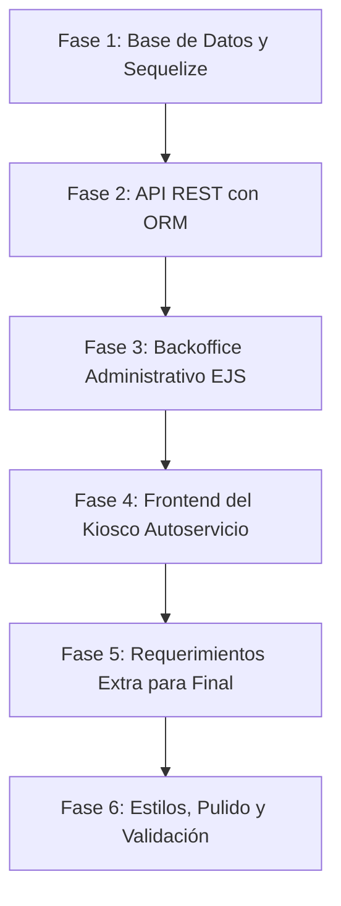

# 🗺️ Hoja de Ruta - TP Integrador "Autoservicio"
### 🎓 Programación III (DIV132) - UTN Avellaneda
**Integrantes del Grupo 12:** Franco Espósito & Francisco Cuenca

Este documento es una guía paso a paso y hoja de ruta detallada para el desarrollo de su Trabajo Integrador (Segundo Parcial + requerimientos para final). Sirve como guía de referencia rápida para saber en qué etapa del proyecto se encuentran y qué tareas corresponden a cada uno.

---

## 🏗️ Estructura del Repositorio

El proyecto está dividido en dos carpetas principales:
*   📂 [tpIntegrador_Front](file:///c:/Users/Usuario/Desktop/Nueva%20carpeta%20(2)/Segundo.Parcial.Programacion.III.DIV132/tpIntegrador_Front): Aplicación del cliente (Kiosco Autoservicio) usando HTML, CSS y JavaScript del lado del cliente.
*   📂 [tpIntegrador_Back](file:///c:/Users/Usuario/Desktop/Nueva%20carpeta%20(2)/Segundo.Parcial.Programacion.III.DIV132/tpIntegrador_Back): Servidor Node.js con Express, ORM (Sequelize), vistas administrativas EJS y la API REST en JSON.

---

## 🎨 Paso 0: Definición del Rubro de Ventas
> [!IMPORTANT]
> **No pueden utilizar productos de comida.**
> Deben ponerse de acuerdo en un rubro que venda **2 categorías de productos** relacionados.
> *Ejemplos recomendados:*
> 1.  **Tecnología:** *Categorías:* "Consolas" y "Videojuegos" (o "Auriculares" y "Teclados").
> 2.  **Moda / Deportes:** *Categorías:* "Zapatillas" y "Remeras".
> 3.  **Librería Geek:** *Categorías:* "Libros" y "Mangas/Cómics".
> 4.  **Hardware:** *Categorías:* "Procesadores" y "Placas de Video".

---

## 🗺️ Hoja de Ruta Paso a Paso

---

### 🗄️ Fase 1: Base de Datos y Configuración Inicial (Backend)
El primer paso es modelar y preparar la base de datos MySQL usando Sequelize para cumplir con la consigna de **"Utilizar un ORM"**.

1.  **Instalar dependencias necesarias en [tpIntegrador_Back](file:///c:/Users/Usuario/Desktop/Nueva%20carpeta%20(2)/Segundo.Parcial.Programacion.III.DIV132/tpIntegrador_Back):**
    *   Instalar Sequelize y el driver de mysql: `npm install sequelize`
    *   Instalar Bcrypt para encriptar contraseñas: `npm install bcrypt`
    *   Instalar Multer para subir imágenes de productos: `npm install multer`
    *   Instalar XLSX o ExcelJS para generar los reportes Excel: `npm install exceljs`
2.  **Configurar Sequelize en `tpIntegrador_Back/src/api/database`:**
    *   Reemplazar la conexión de pool cruda de [db.js](file:///c:/Users/Usuario/Desktop/Nueva%20carpeta%20(2)/Segundo.Parcial.Programacion.III.DIV132/tpIntegrador_Back/src/api/database/db.js) por una instancia de Sequelize.
3.  **Crear los Modelos de Sequelize:**
    *   `Product`: `id`, `name`, `image` (ruta de la imagen guardada en servidor), `category`, `price`, `active` (booleano para la baja lógica).
    *   `User`: `id`, `name`, `email`, `password` (encriptado), `es_admin` (booleano).
    *   `Sale`: `id`, `customer_name`, `date` (fecha actual), `total_price`.
    *   `SaleProduct` (Tabla intermedia Muchos a Muchos): `SaleId`, `ProductId`, `quantity` (cantidad del producto comprado).
    *   `Log` (Para final): `id`, `UserId`, `action` (ej: "Inicio de sesión exitoso"), `date`.
    *   `Survey` (Para final): `id`, `opinion` (textarea), `email` (email), `newsletter` (checkbox), `rating` (slider de 1 a 10), `image_path` (file), `date`.
4.  **Sincronizar y Sembrar (Seeds) la Base de Datos:**
    *   Crear un script para inicializar la DB con algunos productos cargados (al menos 6-8 para probar paginación).
    *   Crear al menos un usuario administrador de prueba (con contraseña cifrada con `bcrypt`).

---

### 🔌 Fase 2: Desarrollo de la API REST (Backend JSON)
Desarrollar los endpoints en Express que devolverán JSON y serán consumidos por el Frontend y los controladores. Deben seguir una estructura clara en carpetas utilizando el patrón **MVC (Model-View-Controller)**.

1.  **Estructurar en Carpetas (MVC):**
    *   `src/api/controllers/`: Funciones de lógica para manejar peticiones.
    *   `src/api/routes/`: Rutas del servidor.
    *   `src/api/middlewares/`: Validación de datos.
2.  **Endpoints para Productos (`/api/products`):**
    *   `GET /api/products`: Devuelve productos activos. Debe soportar **paginación** (`?page=1&limit=4`).
    *   `GET /api/products/:id`: Devuelve un único producto por ID (con datos completos).
    *   `POST /api/products`: Recibe los datos de un nuevo producto junto con su imagen usando **Multer** y los guarda.
    *   `PUT /api/products/:id`: Actualiza los datos de un producto (si se sube una nueva imagen, reemplazar la anterior).
    *   `DELETE /api/products/:id`: Aplica **baja lógica** cambiando la propiedad `active` a `false`.
3.  **Endpoints para Ventas (`/api/sales`):**
    *   `POST /api/sales`: Guarda una venta con los productos asociados en la tabla intermedia y calcula el total.
    *   `GET /api/sales`: Devuelve el listado de ventas realizadas junto con los productos asociados.
4.  **Endpoints para Usuarios y Autenticación:**
    *   `POST /api/users`: Endpoint privado para crear un usuario administrador (guarda la contraseña con `bcrypt.hash()`).
5.  **Middlewares de Validación:**
    *   Crear middlewares que validen que los datos ingresados en `POST` y `PUT` de productos no estén vacíos y tengan tipos de datos correctos antes de llegar al controlador.

---

### 💻 Fase 3: Backoffice Administrativo EJS (Backend Views)
Esta sección se encarga del renderizado HTML desde el servidor para los administradores. Debe estar en el mismo servidor Express.

1.  **Configurar Express para usar EJS y carpetas públicas:**
    *   `app.set("view engine", "ejs");`
    *   Configurar la carpeta para archivos estáticos (CSS, imágenes subidas, scripts).
2.  **Pantalla de Login (`/admin/login`):**
    *   Formulario para ingresar correo y contraseña.
    *   > [!IMPORTANT]
        > **Botón de acceso rápido:** Debe existir un botón autocompletar que llene los campos automáticamente con las credenciales de prueba del administrador para facilitar la corrección de los docentes.
    *   Validar contraseñas comparando con `bcrypt.compare()`.
3.  **Pantalla de Dashboard / Panel Principal (`/admin/dashboard`):**
    *   Debe requerir autenticación previa (guardar estado de sesión en una cookie/session).
    *   Mostrar una tabla con el catálogo completo de productos, separados/filtrados por tipo (o en secciones bien delimitadas).
    *   Mostrar claramente el estado de cada producto: Activo o Inactivo.
    *   Botones de acción rápidos por cada producto:
        *   **Modificar:** Redirige al formulario de edición.
        *   **Desactivar (Baja lógica):** Cambia `active` a `false` (mostrar un modal de confirmación antes).
        *   **Activar (Reactivar):** Cambia `active` a `true` (mostrar un modal de confirmación antes).
4.  **Pantalla de Creación y Edición (`/admin/products/new` y `/admin/products/edit/:id`):**
    *   Formulario completo para cargar/editar nombre, precio, categoría y subir el archivo de la imagen.
    *   *Tip:* Se puede reutilizar la misma plantilla EJS para alta y edición pasando variables de control.
5.  **Descarga de Ventas en Excel (`/admin/sales/export`):**
    *   Un botón que al presionarlo genere y descargue un archivo `.xlsx` con todas las ventas registradas.

---

### 🛒 Fase 4: Frontend del Kiosco de Autoservicio (Cliente)
Esta aplicación representa la pantalla táctil de un kiosco de autoservicio. Debe ser **completamente responsive** (adaptada para móviles y tablets) y interactuar con la API REST del backend mediante `fetch()`.

1.  **Pantalla de Bienvenida:**
    *   Página de inicio que solicita obligatoriamente el nombre del cliente.
    *   No permite avanzar a los productos hasta que se haya ingresado y validado el nombre (guardarlo en `sessionStorage` o `localStorage`).
2.  **Pantalla de Catálogo de Productos:**
    *   Muestra los productos activos de forma atractiva.
    *   Permite filtrar o navegar entre las **dos categorías** del negocio.
    *   **Paginación:** Botones para ir a la página siguiente/anterior para evitar sobrecargar la vista.
    *   Cada producto muestra su imagen, nombre, precio y un botón para agregarlo al carrito.
3.  **Pantalla de Carrito:**
    *   Listado de los productos seleccionados con subtotales por producto y el total general.
    *   Botones de `+` y `-` para modificar cantidades de forma dinámica.
    *   Botón para eliminar un producto del carrito.
    *   Botón de "Confirmar Compra": Abre un modal de confirmación preguntando si desea finalizar la compra.
    *   Al confirmar, hace un `POST` a `/api/sales` con el nombre del cliente y los productos.
4.  **Pantalla de Ticket:**
    *   Una vez guardada la compra, redirige a esta pantalla.
    *   Muestra el ticket de compra formalizado: productos, cantidades, precio individual, subtotal, precio total, nombre del cliente, fecha del día y nombre de la empresa.
    *   **Descarga en PDF:** Agregar un botón para descargar este ticket en PDF (se puede usar la librería `html2pdf.js` o `jspdf` directamente en el frontend).
    *   **Botón Salir / Reiniciar:** Redirige a la pantalla de bienvenida borrando el carrito y el nombre almacenado.
5.  **Persistencia del Tema (Claro / Oscuro):**
    *   Un interruptor de tema claro/oscuro en el header de la aplicación.
    *   Debe persistir usando `localStorage` para que al recargar la página se mantenga el tema elegido.

---

### 🎁 Fase 5: Requerimientos Extra para Fecha de Final (Ambos)
Si van a promocionar directamente o prepararse para la fecha de final, deben implementar estas características:

#### Para el Cliente (Frontend):
1.  **Pantalla de Detalle de Producto (`/product-detail.html?id=...`):**
    *   Al hacer clic en un producto del catálogo, abre una pantalla específica que carga los detalles completos desde `GET /api/products/:id`.
2.  **Pantalla de Encuesta al Salir:**
    *   Al presionar "Salir" en la pantalla de ticket, redirige a una encuesta de satisfacción.
    *   **Obligatorio: 5 tipos de inputs:**
        1.  `textarea`: Opinión del servicio.
        2.  `email`: Correo del cliente.
        3.  `checkbox`: Aceptar newsletter / promociones.
        4.  `slider (range)`: Puntuación del servicio (1 al 10).
        5.  `file`: Carga de imagen (por ejemplo, foto del ticket o del local).
    *   Validar datos (mostrar mensajes de error estilizados si falla).
    *   Debe permitir omitirse mediante un botón secundario ("Omitir") poco llamativo.
    *   Al enviar, guarda los datos mediante un `POST /api/surveys` (usando Multer para subir el archivo) y muestra un modal de agradecimiento antes de reiniciar el kiosco.

#### Para el Administrador (Backoffice):
1.  **Pantalla de Registros / Logs (`/admin/records`):**
    *   Muestra un listado del historial de LOGs (cuándo iniciaron sesión los administradores).
    *   Muestra tablas de estadísticas avanzadas:
        *   Top 10 de productos más vendidos.
        *   Top 10 de ventas más caras.
        *   Otras 2 estadísticas de elección libre (ej: promedio de gasto por cliente, horas pico de ventas, etc.).
2.  **Descarga de Encuestas:**
    *   Botón en el panel de administración para exportar todas las encuestas respondidas a un archivo Excel.

---

### 🎨 Fase 6: Estilos, Pulido y Validación
*   **Estilo Visual Premium:** La consigna pide explícitamente tener criterio a la hora de dar estilos. Utilicen colores armónicos, variables CSS, fuentes modernas (ej: Google Fonts) y sombras sutiles.
*   **Diseño Responsive:** Ambas partes del sistema (autoservicio y backoffice) deben ser fluidas tanto en PC de escritorio como en smartphones.
*   **Middlewares y Manejo de Errores:** Aseguren que el backend no se caiga ante peticiones incorrectas. Retornen códigos HTTP adecuados (`200 OK`, `201 Created`, `400 Bad Request`, `401 Unauthorized`, `404 Not Found`, `500 Internal Server Error`).

---

## 🤝 Consejos de Colaboración y Trabajo en Equipo

*   > [!WARNING]
    *   **Revisión de Commits:** Los profesores revisarán los commits para asegurar que ambos trabajaron en los dos proyectos (Frontend y Backend). Distribuyan las tareas de forma equitativa.
*   **Ramas en Git (Git Branches):** Eviten programar todo en `main`. Creen ramas como `feature/api-rest`, `feature/ejs-backoffice`, `feature/kiosco-front`, y únanlas mediante Pull Requests en GitHub después de probarlas.
*   **Base de datos local compartida:** Aseguren tener configurado un archivo `.env` en sus computadoras locales para que cada uno pueda conectarse a su respectiva base de datos local sin cambiar el código base.

---

## 📋 Lista de Chequeo de Progreso (TODO)

### Backend (Express + Sequelize)
- [ ] Configurar Sequelize y conexión a MySQL en [db.js](file:///c:/Users/Usuario/Desktop/Nueva%20carpeta%20(2)/Segundo.Parcial.Programacion.III.DIV132/tpIntegrador_Back/src/api/database/db.js).
- [ ] Definir modelos (`Product`, `User`, `Sale`, `SaleProduct`, `Log`, `Survey`).
- [ ] Implementar cifrado de contraseñas con `bcrypt`.
- [ ] Crear endpoints de API para CRUD de productos (con paginación).
- [ ] Crear endpoint de API para registrar ventas (`POST /api/sales`).
- [ ] Configurar subida de archivos (Multer) en el servidor.
- [ ] Implementar middlewares de validación.

### Backoffice Administrador (EJS)
- [ ] Configurar motor de plantillas EJS y rutas.
- [ ] Pantalla de Login con botón de acceso rápido.
- [ ] Dashboard de administración (tabla de productos activos/inactivos, activar/desactivar lógica).
- [ ] Formularios de Alta y Edición de productos (carga de imágenes en backend).
- [ ] Exportación de ventas a Excel (`exceljs`).

### Kiosco Autoservicio (Frontend)
- [ ] Pantalla de Bienvenida (ingreso obligatorio de nombre).
- [ ] Consumo de API `/api/products` con renderizado de tarjetas.
- [ ] Filtro por categorías y paginación en el frontend.
- [ ] Gestión interactiva de Carrito (sumar, restar, eliminar).
- [ ] Modal de confirmación de compra y envío de datos (`POST`).
- [ ] Visualización de Ticket y descarga en PDF.
- [ ] Persistencia de Tema Claro/Oscuro en `localStorage`.

### Requerimientos de Final (Opcional en Cursada / Obligatorio en Final)
- [ ] Detalle de producto individual consumiendo por ID.
- [ ] Formulario de encuesta con los 5 inputs validados y subida de archivos.
- [ ] Pantalla de registros/logs de administradores en backoffice.
- [ ] Tablas de estadísticas (Top 10 ventas, Top 10 productos, etc.).
- [ ] Descargar reporte de encuestas a Excel.
